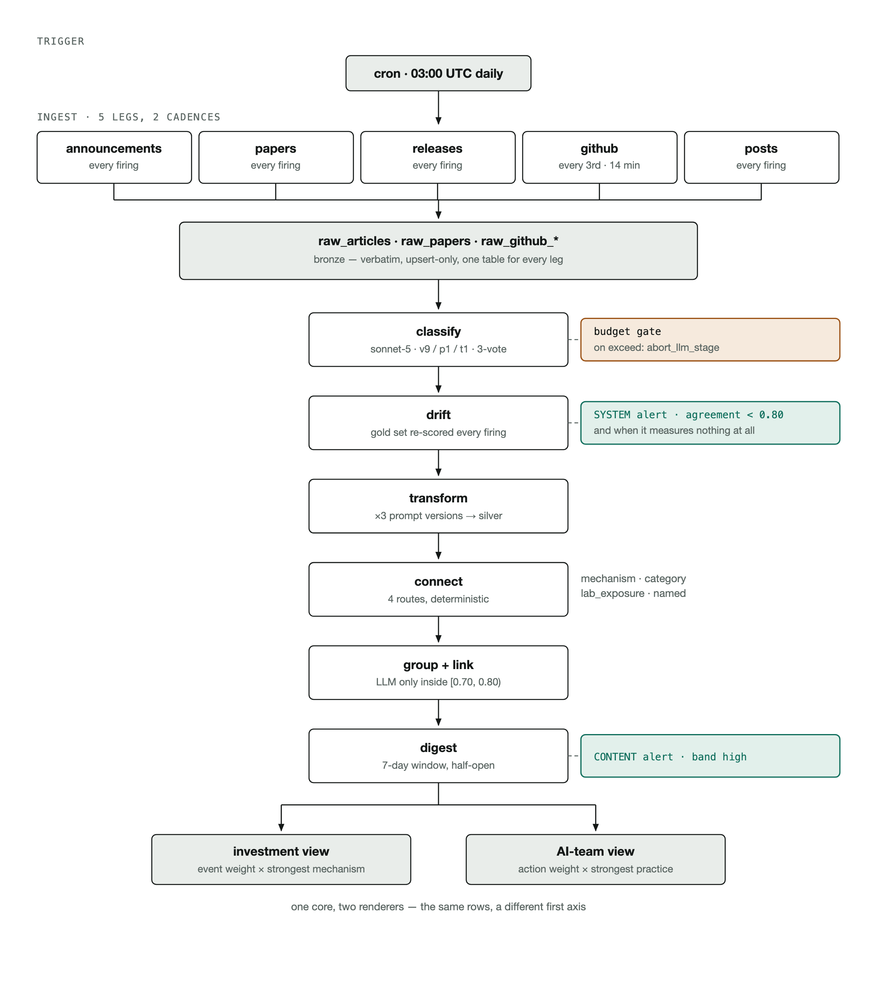
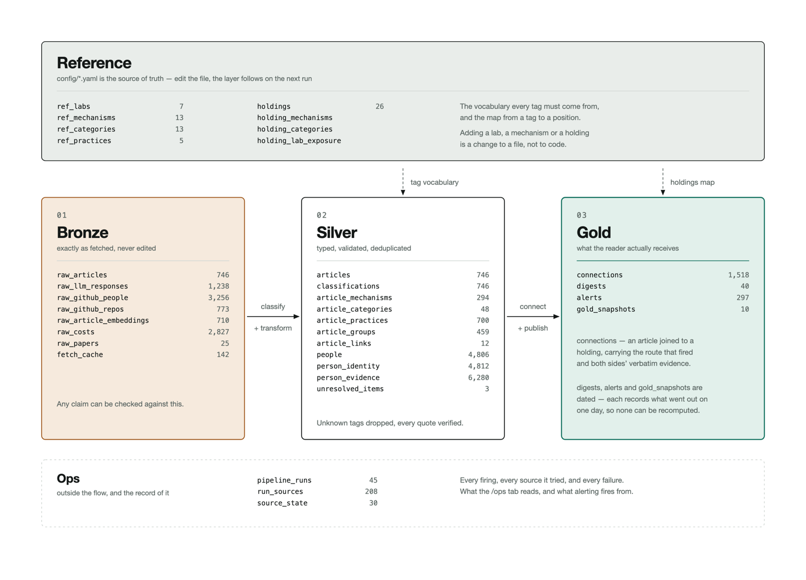

# Overview of BIT Capital Frontier Lab Intelligence App

The BIT Capital Frontier Lab Intelligence app pulls the latest signals from a series of Frontier AI Labs. The signals are linked with investments currently in the BIT Capital (BitCap) portfolio, indicating how these signals could impact BIT Capital positions as well as the strength of these impacts.

### Discussion of the principles of Design

The first design principle for the app was to link announcements to BitCap positions. I did an analysis of BitCap positions across portfolios and settled on the positions within the Technology Leaders portfolio. These positions represent roughly 1.4B € or 47% of BitCap's holdings and announcements by AI Frontier Labs are also most likely to influence these tech-oriented positions, acknowledging that there is overlap in investments across portfolios.

When a source is scored, it links back to a BitCap position through a linked Mechanism (see Scoring below). The user can then see a rated impact of the source on the investment, whether positive, negative or mixed.  

### Scoring

The scoring was fit into a series of categories which were linked with BitCap's current holdings.

The event types mechanism answers what kind of event happened. Events have a score ranging from 5 to 0 and include categories like frontier_model_release (5), corporate_finance (4), developer_tooling (2).

The Mechanism category answers how the event transmits to BitCap’s holdings. For the *Mechanism* category, these were grouped into Compute and Infrastructure Demand, Efficiency and Displacement, Capability and Demand Shape and Structural, with individual categories under each. These were developed collaboratively with Sonnet, with each mechanism linking to a company and with a sign. For example, *custom_silicon_substitution* is positive for Micron as their product goes into all accelerators, but negative for Nvidia who would likely loose out from an AI Lab making their own accelerators.

To get an investment team score we take the event score multiplied the magnitude and confidence of the highest scoring mechanism and normalise.

Practices are specifically for the AI Team and answer what would we do differently, these include integration, evaluation, model_capability, orchestration and serving efficiency.  These are also paired with an action score indicating whether the team should adopt, investigate or watch the development.

To get an AI Team score we take the action score and multiply it by the practices score times the confidence and normalise.

The model was asked to grant a confidence score to the rating which it gave. The confidence was based on the evidence found in the document. For every document it scored, the LLM had to support the evidence with a quote. The quotes were then checked by a deterministic process to ensure that the model was not hallucinating a quote. The check requires the quote to appear verbatim in the article text, and a tag whose quote is not there is dropped rather than downgraded, so it cannot contribute to a score at all. The quote is shown next to the tag on the item detail page and in the digest, so a reader can search for it in the original and find it.

The confidence scores were multiplied into the overall score, such that low = 0, medium = 0.5, high = 1.0. The multiplier for low was selected empirically based on looking at scored articles where the quoted evidence was weak. Medium was selected as 0.5 to indicate uncertainty and high a 1.0 to indicate certainty.

There are separate scoring prompts for the sources. The announcements (articles) and GitHub releases share a scoring prompt (they share the same shape), papers and X posts each have their own. Each prompt is versioned. Prompts were written by Fable 5. In the case of the announcements, the prompts are compared against a gold-test. This serves to test the prompt's agreement, but also to measure variance in the results over time. This second point is discussed further in the *System Health* section.

All sources are re-scored when a prompt relevant to that source type changes.

Most of what is collected scores zero: 348 of 447 announcements and releases, 33 of 47 papers and 210 of 238 X posts. This is not on accident as the purpose of the pipeline is remove noise. 

Although different sources are not weighted differently, X posts generally score lower, in part because they often lack the evidence needed for a confident label from the model. However, a post with real signal still reaches the top: the highest scoring item anywhere in the system is a single post from OpenAI's Mark Chen committing to 4+ GW of NVIDIA capacity, which had no press release behind it.

## Sources

### Labs selected

From an intial list of 21 labs 7 were selected. This initial list was created through AI research where the labs were placed into four buckets, Closed Frontier, China, Western Challengers, and Stealth/New Modality. Meta AI entered Closed Frontier due to their move away from open weights models recently. 

I selected all of the Closed Frontier labs, DeepSeek from China and Mistral from Western Challengers. The Closed Frontier labs were selected because of their size and impact on the market. DeepSeek was selected because of the impact of DeepSeek R1 on the market (-17% of Nvidia's share price a week after the launch). Mistral was chosen because of a hypothesised impact it could have on driving European-based AI development, including Data Centre build out. 

A second reason for chosing 7 labs was to limit the size of the sample to lower costs and make development more managable in the time frame. In a second phase of the project I would include additional labs.

### Lab announcements

Announcements are discovered per lab and the method differs because the sites do. Every entry is a config change in `config/sources.yaml`, but the code for extraction is the same for each.

| Lab | Channels | Why |
|---|---|---|
| Anthropic | Sitemap | No RSS feed exists at any path tried |
| OpenAI | RSS + model index + dev forum (3) | Cloudflare serves XML but 403s HTML, so discovery is RSS; the other two were added after RSS alone missed the GPT-6 Astra launch |
| DeepSeek | Sitemap | Release notes sit on the API docs site; slugs encode the date |
| Google DeepMind | RSS | The sitemap is not a blog index — it carried 12 articles to RSS's 30, missing nearly every model launch |
| Mistral | RSS | Feed is English-only with a clean pubDate; the sitemap duplicates every item under /fr/ |
| Meta AI | Blog listing + Newsroom RSS (2) | No blog RSS and the sitemap is crawler-gated; the Newsroom carries the data-centre and capex news the AI blog never does |
| xAI | Internet Archive (CDX) | Live x.ai is fully Cloudflare-blocked, including sitemap.xml itself |

### Papers

Papers have no shared discovery method each lab's harvester is genuinely different because the labs publish differently. Once the papers have been downloaded, they are processed in the same way.

| Lab | How papers are found |
|---|---|
| DeepSeek | arXiv query `au:"DeepSeek-AI"`, plus a short extra-titles list |
| Google DeepMind | Sitemap discovery, then LLM byline extraction off the linked arXiv page |
| Meta AI | Listing 500s, so via ai.meta.com/results/ with the arXiv id resolved from the title |
| Anthropic | Deterministic parser, with an LLM fallback left off by default |
| OpenAI | A hardcoded list — OpenAI publishes no papers index that can be enumerated |
| Mistral | No publications page exists, so candidate titles are mined from Mistral's own announcements corpus |
| xAI | Not covered. arXiv has no affiliation search field, and every query for xAI or Grok collides with eXplainable AI, grokking, or third-party papers *about* Grok. Checked twice live |

### Github

The GutHub pages of the selected labs were found by research with Claude and included in the GitHub sourcing config file. Relevant repos were then selected such that forks, archived repos and anything not pushed to in the window were dropped first. Of the remaining 770 repos we ranked them by the number of stars on them and chose the Top 10 from each lab. These were then passed to a classifier to pick which ones were relevant for our project (see Model Selection below). Releases from the only the selected repos were then scored using the LLM classifier in the same manner as lab announcements are scores.  

The GitHub data collected also includes all of the people who made commits during the time period. The initial idea was to use these people lists to explore the person blogs and X accounts of these people. This was abandoned for now due to the sparsity of X accounts and personal blogs for the contributors as well as costs of the X API (see below). Given the data is available, this could be explored in a second stage of the project.

### X Posts

X posts were sources only from the leaders of the Frontier AI Labs, where these leaders were sourced and verified through a research process with Claude. The research was instructed to find two sources corroborating their leadership position. When their X-posts were linked to their profiles, where their position was available, this was amended to their profiles.

An LLM-based online research showed that Elon Musk would have posted approximately 2500 - 3000 posts over the 3 month data collection period. Therefore, in the spirit of savings costs, these posts were excluded.

Posts were extracted using the X-API for leaders who has posted in the past three months. The posts were then scored with a separate X-specific prompt with Sonnet 5. 

## Pipeline

The pipeline is maintained by a yaml file indicating the cadence, cost limits and the relative frequency of certain runs. Additional parameters include retry parameters.

Render.yaml declares the pipeline as a cron service whereby it is run on schedule every morning at 5am. It can also be run manually in the Pipeline tab of the tool. When running manually, the user can select to just run specific parts of the pipeline.

The pipeline runs in eight phases in a fixed order. There’s also a per source failure isolation, so if one of the sources breaks, the others can still be processed. 

*Figure 1The stages of the ETL Ingestion Pipeline*

The data is processed in a medallion archicture. The Bronze layer is updated whenever new data is added to the pipeline when the pipeline is run for one or more of the parts. The Silver layer is then processed deterministically. For example, the scoring algorithm (but not the LLM labels) can be adjusted and the Silver Layer rerun without having to reprocesses the Bronze layer. The Gold layer brings together the company (BitCap) holding data with the data from the Silver layer to create the objects on the UI.

*Figure 2 The Medallion architecture*

## Grouping

Articles covering the same event are grouped so the feed shows one row per event rather than one row per source. Three deterministic passes run first: exact matches on lab, date and title, release trains from a single repo, and a requirement that the event type matches before anything can merge at all. The remaining pairs are compared by embedding, and only those in a narrow cosine band are sent to an LLM to decide, because on the pairs I labelled the cosine score does not separate duplicates from near misses cleanly enough to cut at one threshold. Pairs at or above 0.80 merge unasked, pairs below 0.70 stay separate, and the model is only asked in between.

## Alerts Digest

The digest in the Alerts tab is a daily edition of the highest scoring items from the previous 24 hours, rendered separately for the investment team and the AI team from the same underlying data. The landing view is a rolling seven day preview, so it is never empty on a quiet day. When the pipeline runs each day, it creates a published set of articles from the past 24 hours which the user can then investigate by selecting it in the drop down menu at the top of the Alerts.

### Pipeline alerts and failures

The pipeline runs unattended overnight, so it is built to fail in a way I can see.

- Fetches retry four times with exponential backoff and are rate limited per host. Each source keeps its own watermark and failure count, so one source breaking does not reset or block the others.

- Re-runs are safe and cheap. The work list is whatever the current prompt version has not scored yet, read from the database, so a second run in the same night does nothing. Cost ceilings per run and per month stop further calls and finish with what they have rather than failing and discarding an ingest that already happened. Only one run can happen at a time, enforced by the database rather than a flag.

- System alerts are kept separate from content alerts. A content alert says the pipeline found something, a system alert says the pipeline itself is broken, for example a source failing three runs in a row or gold set agreement dropping below 0.80.

### System Health

The pipeline run can be checked in the system health tab in the app. It indicates which parts of the pipeline ran with and without errors. The user can reset the errors with a button at the bottom of the page.

There is also a drift check which compares the model’s output to a gold set of scored example annoucements. This drift reports two things. One, the latest agreement of the scoring model on the gold set and two, how this drifts over time. The drift over time serves as a proxy for the variability of the scoring model's outputs. This is discussed further in the next section.

## Costs

Cost logs were collected throughout the development cycle. Based on these, the cost of scoring the full pipeline for the three month period is roughly ~13.50€, with the X posts pulled from the limited list of leadership being ~3€.

The costs for each daily pipeline run are ~1€. This includes the cost for the drift checker at ~0.80€.

## Model selection

To score the sources, namely lab announcements, github releases, X-posts and papers, Sonnet 5 was used. Sonnet 5 was compared against Haiku 4.5 and GPT5-mini on the gold set of announcements over three runs. Haiku was removed because it consistently scored an important article 0. GPT5-mini was removed because of a very high variances with its results across runs.

As noted above, a drift report is run nightly and can be run on command to compare the results from the lab announcement scoring model with the gold set. I acknowledge that there is variance on these results and that the current score, generally around 0.85 Micro-F1 could be improved. I tested a version of the scorer that runs three times on each article and scores based on the majority label with both Sonnet 5 and GPT5-mini. Sonnet 5 performed well, but the variance was still very high with GPT5-mini. This cost of this was however too high in development where I was regularly rescoring the whole 3 months of the corpus. If I had more time, I would have moved over to this scoring method for the sources.

Due to the length of the announcements being scored, I tried to see if it was possible to first summarise them and then score them. I tested summarisation with Sonnet 5, Haiku 4.5 and GPT5-mini, however there was significant degradation of the results on the gold set and the token saving was small – less than 20% per announcement / article on average. This was due partly to the length of the classification prompt. A significant cost saving (~50%) was achieved by applying prompt caching to this prompt first.

For choosing which Frontier AI Lab repos might be relevant to the AI team, the repos are classified using GPT5-mini. GPT5-mini was chosen over Haiku 4.5 for this task based on the results on a set of labelled repos, labelled by Fable 5. The Fable labels were validated by comparing them to a subset of 20 items from this list that I had hand scored where agreement was 95%. Sonnet 5 was not tested for this task. Note this was a filter stage. Once filtered, the repos were then scored by Sonnet 5.

## Development cycle

I started off with a planning document based on the case-study and sketched out the high-level steps for the project. I clearly stated in the planning document that every decision needs to be recorded in a decisions
 document. The key points from this document were included in the CLAUDE.md file governing the sessions. I also indicated that unit tests must be written for everything the agents do.

Each part of the pipeline started with an interactive research session with a Claude agent. Sources were discovered and scripts built for extracting them. These were then built into a pipeline once they had been validated.

I ran different agents in different work-trees simultaneously to work on different features. Along with tracking all key decisions in the decisions document, the agents also wrote short handover documents for other agents once a larger feature was complete. This helped the agents to maintain context throughout the project as it developed.

I cycled in a loop of using planning mode to define a feature to be worked on, then having the agent write the code, pass it to a code reviewer agent, make the changes, often call the code reviewer again, make final changes and then submit a PR.

As part of the CI process, a separate suite of unit tests are run that must be passed for every push and PR. The agent runs these tests before pushing and they are run again on GitHub for the push and for any PR.

The app is deployed to Render. Whenever a merge happens on the `deployment` branch (a renaming of main), the app is deployed to Render.

## Security Analysis

A security analysis of the code base was conducted using GPT-6 Astra in Codex. Three vulnerabilities were found, as listed in Codex:

- Medium: The unauthenticated /api/health endpoint exposes internal operational details, including pipeline errors, source information and processing state.

- Medium: A race condition in login rate limiting allows concurrent requests to exceed the intended attempt limit increasing password guessing and potentially exhausting server resources.

- Low: When the local Docker Compose database is running, someone who can reach your computer over the network on port 5432 — subject to firewall rules — could use the committed superuser password to read, modify or delete the database.

These concerns are acknowledged, however the risk appears to be low given all of the information is public and the database on could be reconstructed easily in the third risk identified.

### Insights

- Mark Chen of OpenAI on X, 17 August: "We're excited to go big with NVIDIA and sign up for 4+ GW of capacity", scored 100 as a compute commitment, naming a holding and a gigawatt figure in a post with no press release behind it.

- Meta's venture with BlackRock to build a 1 GW data centre in El Paso at roughly $14 billion in development costs, also scored 100, which came in on the Meta Newsroom feed and does not appear on Meta's AI blog at all.

## Next Steps and Improvements

- Incorporate additional labs into the data. I would start off with incorporating additional labs from China into the sample.

- Update the scoring LLM to do three scorings of each source and choose the most often occuring label. In the event of a tie, take the median of the three runs' event weights, rounding down. Do the same reduction applied to a mechanism's magnitude and confidence. Flag the item as contested rather than resolving it silently. 

- The grouping of articles together is not currently functioning on the alerts digest as it functions on the dashboard. With additional time, I would include this feature. 

- The tweets are currently not being grouped either and there is some overlap. I would apply the grouping process to these too in a future release.
